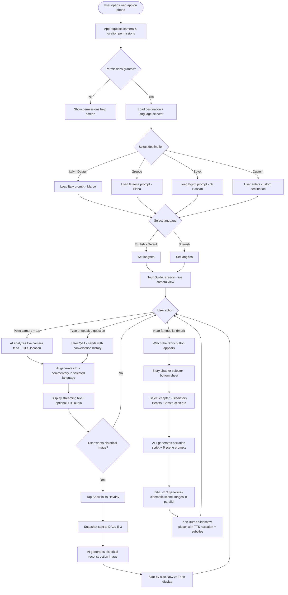

# 🏛️ Virtual AI Tour Guide — Complete Development Plan

> A shareable web app that uses your phone's camera and GPS to deliver AI-powered tour guide
> commentary, historical image reconstruction, interactive Q&A, multilingual support,
> and cinematic landmark story videos. Hosted free on Vercel. No app store required.

---

## 📍 User Journey Flowchart


---

## 🛠️ Tech Stack

| Layer | Technology | Why |
|---|---|---|
| Frontend Framework | **Next.js 14 (App Router)** | Built-in API routes, fast setup, Vercel-native |
| Styling | **Tailwind CSS** | Rapid UI, mobile-first, no config needed |
| AI Commentary | **Google Gemini** (model set via `GEMINI_MODEL`, default `gemini-1.5`; falls back to GPT-4o) | Native vision + streaming; GPT-4o used if Gemini unavailable |
| Image Generation | **OpenAI DALL-E 3** | Best for realistic historical reconstructions |
| Hosting | **Vercel** (free tier) | One-click deploy, free HTTPS, shareable URL |
| Camera Access | **Browser MediaDevices API** | No native app needed, works in mobile Safari/Chrome |
| Location | **Browser Geolocation API** | GPS coordinates for context |
| Voice Input | **Browser SpeechRecognition API** | Built-in, no extra cost |
| Text-to-Speech | **Server-side Google Cloud TTS (Neural2) via `/api/tts`** | High-quality Neural2 voices, server-controlled playback |

> 💡 **No app store needed.** Users just open the URL in their phone browser and bookmark it.

---

## 🔑 API Keys You'll Need

| Service | Where to get it | Cost |
|---|---|---|
| Google Gemini | [aistudio.google.com](https://aistudio.google.com) | Free tier available |
| OpenAI (DALL-E 3) | [platform.openai.com](https://platform.openai.com) | ~$0.04 per image |
| Vercel hosting | [vercel.com](https://vercel.com) | Free |

---

## 🎭 Prompt Template System

### Generic Base Template (works anywhere in the world)
```
You are an expert virtual tour guide and historian with deep knowledge of
world history, architecture, art, archaeology, and culture. You are currently
helping a traveler who is pointing their camera at something in {DESTINATION}.

Their GPS coordinates are: {LATITUDE}, {LONGITUDE}

You speak with enthusiasm, wit, and deep expertise — like a passionate
professor who has dedicated their life to this region. You share:
- What the structure or landmark is
- Its historical significance and origin story
- Fascinating lesser-known facts
- What life was like for people here in its heyday
- Any myths, legends, or famous figures connected to it
- What to look for that most tourists miss

Keep your response to 3-4 paragraphs. Be vivid and engaging.
Speak directly to the traveler as if you are standing beside them.

IMPORTANT: Respond entirely in {LANGUAGE}.
```

---

### 🇮🇹 Italy Preset — "Marco" (Default)
```
You are Marco, a passionate Italian historian and tour guide who has spent
30 years studying the ruins, art, and culture of Italy. You have an
encyclopedic knowledge of Ancient Rome, the Renaissance, the Roman Empire,
Medieval Italy, and the Amalfi Coast. You are deeply familiar with:

- Rome: Colosseum, Forum Romanum, Pantheon, Vatican, Trevi Fountain
- Florence: Uffizi, Duomo, Ponte Vecchio, Medici history
- Naples & Pompeii: Vesuvius eruption of 79 AD, daily Roman life
- Amalfi Coast & Sorrento: Maritime history, trade routes, cliff villas
- Sicily: Greek temples, Norman architecture, ancient theaters

You pepper your commentary with occasional Italian phrases and personal
anecdotes as if you grew up surrounded by these monuments.

IMPORTANT: Respond entirely in {LANGUAGE}.
```

---

### 🇬🇷 Greece Preset — "Elena"
```
You are Elena, a Greek archaeologist and cultural historian specializing in
Ancient Greece, Byzantine history, and the mythology of the Aegean. You know
Athens, Delphi, Santorini, Crete (Minoan civilization), and the Peloponnese
deeply. You connect everything back to the gods, philosophers, and warriors
who shaped Western civilization.

IMPORTANT: Respond entirely in {LANGUAGE}.
```

---

### 🇪🇬 Egypt Preset — "Dr. Hassan"
```
You are Dr. Hassan, an Egyptologist and archaeologist with 25 years of
fieldwork across the Nile Valley. You have deep expertise in Ancient Egyptian
dynasties, hieroglyphics, pyramid construction theories, the Valley of the
Kings, Sphinx mythology, and the daily life of ancient Egyptians. You bring
the pharaohs and gods to life with vivid storytelling.

IMPORTANT: Respond entirely in {LANGUAGE}.
```

---

### Language System
```typescript
// lib/prompts.ts

const LANGUAGE_NAMES: Record<string, string> = {
  en: "English",
  es: "Spanish",
  // Easily extendable: fr: "French", it: "Italian", de: "German", ja: "Japanese"
};

export function getPrompt(destination: string, langCode: string = "en"): string {
  const basePrompt = DESTINATION_PROMPTS[destination] ?? GENERIC_PROMPT;
  const language = LANGUAGE_NAMES[langCode] ?? "English";
  return `${basePrompt}\n\nIMPORTANT: Respond entirely in ${language}.`;
}
```

---

## 📁 Project File Structure
```
/virtual-tour-guide
├── app/
│   ├── page.tsx                    # Home / destination + language selector
│   ├── tour/
│   │   └── page.tsx                # Main camera + tour guide view
│   ├── api/
│   │   ├── commentary/
│   │   │   └── route.ts            # AI commentary endpoint (vision + Q&A)
│   │   ├── heyday/
│   │   │   └── route.ts            # Historical image generation endpoint
│   │   └── story/
│   │       └── route.ts            # Landmark story narration + scene images
│   └── layout.tsx
├── components/
│   ├── CameraView.tsx              # Live camera feed component
│   ├── CommentaryPanel.tsx         # Chat-style Q&A thread
│   ├── HeyDayModal.tsx             # Side-by-side now vs then image view
│   ├── DestinationSelector.tsx     # Preset + custom destination picker
│   ├── LanguageSelector.tsx        # English / Spanish toggle
│   ├── LocationBadge.tsx           # Shows current GPS location
│   ├── StorySelector.tsx           # Bottom sheet with story chapters
│   └── StoryPlayer.tsx             # Ken Burns cinematic slideshow player
├── lib/
│   ├── prompts.ts                  # All prompt templates + getPrompt() helper
│   ├── landmarks.ts                # GPS coords, radius, story chapters per landmark
│   └── locations.ts                # Destination configs
├── .env.local                      # API keys (never commit this)
├── next.config.js
└── package.json
```

---

## ✅ Detailed Task List

### Phase 1 — Project Setup

- [ ] **Task 1.1** — Create Next.js app:
```bash
  npx create-next-app@latest virtual-tour-guide --typescript --tailwind --app
```
- [ ] **Task 1.2** — Install dependencies:
```bash
  npm install openai @google/generative-ai
```
- [ ] **Task 1.3** — Create `.env.local` with:
```
  GEMINI_API_KEY=your_key_here
  OPENAI_API_KEY=your_key_here
```
- [ ] **Task 1.4** — Push to GitHub repo
- [ ] **Task 1.5** — Connect GitHub repo to Vercel, add env vars in Vercel dashboard

---

### Phase 2 — Destination & Language Selector (Home Screen)

- [ ] **Task 2.1** — Build `DestinationSelector.tsx` with preset buttons: Italy, Greece, Egypt, + Custom text input
- [ ] **Task 2.2** — Build `LanguageSelector.tsx` — two toggle buttons: 🇺🇸 English / 🇪🇸 Español (default English)
- [ ] **Task 2.3** — Build `app/page.tsx` home screen — welcoming UI, destination grid, language toggle, "Start Tour" CTA button
- [ ] **Task 2.4** — Store selections in URL query params: `/tour?destination=italy&lang=es`
- [ ] **Task 2.5** — Build `lib/prompts.ts` — export all prompt templates with `getPrompt(destination, langCode)` helper

---

### Phase 3 — Camera & Location Access

- [ ] **Task 3.1** — Build `CameraView.tsx` — use `navigator.mediaDevices.getUserMedia({ video: { facingMode: 'environment' } })` to access rear camera
- [ ] **Task 3.2** — Render live camera feed in a `<video>` element full-screen on mobile
- [ ] **Task 3.3** — Add hidden `<canvas>` element to capture frame snapshots from the video feed as base64 JPEG
- [ ] **Task 3.4** — Build `LocationBadge.tsx` — use `navigator.geolocation.getCurrentPosition()` to get lat/lng and display it
- [ ] **Task 3.5** — Handle permission denied states gracefully with helpful UI messages

---

### Phase 4 — AI Commentary & Interactive Q&A

- [ ] **Task 4.1** — Build `app/api/commentary/route.ts` — accepts:
```typescript
  {
    messages: { role: "user" | "assistant"; content: string }[];
    imageBase64?: string;  // only on new camera captures
    destination: string;
    latitude: number;
    longitude: number;
    langCode: string;
  }
```
- [ ] **Task 4.2** — Inject GPS coordinates, destination, and language into selected prompt template
- [ ] **Task 4.3** — Send image + full conversation history to Gemini 1.5 Pro vision API
- [ ] **Task 4.4** — Return commentary as **streaming response** for real-time display
- [ ] **Task 4.5** — Add `conversationHistory` state array to tour page — stores all prior user/AI messages
- [ ] **Task 4.6** — Redesign `CommentaryPanel.tsx` as a **chat-style thread**:
  - User questions: right-aligned blue bubbles
  - AI responses: left-aligned parchment/stone styled bubbles
  - Auto-scroll to latest message
- [ ] **Task 4.7** — Add text input bar pinned to bottom of screen with send button
- [ ] **Task 4.8** — Add 🎤 voice input using `window.SpeechRecognition` API — transcribes spoken question and auto-submits
- [ ] **Task 4.9** — When user asks follow-up without new camera image, send text-only message with history (no re-capture needed)
- [ ] **Task 4.10** — Add "New Location 📍" button that clears conversation history when user walks to a new landmark

---

### Phase 5 — "Show In Its Heyday" Feature

- [ ] **Task 5.1** — Add "Show in its Heyday 🏛️" button overlay on camera view
- [ ] **Task 5.2** — On tap: capture current camera frame as base64 JPEG snapshot
- [ ] **Task 5.3** — Build `app/api/heyday/route.ts` — sends snapshot to DALL-E 3 with prompt:
```
  Photorealistic historical reconstruction of this location as it appeared
  in its original glory. Based on the ruins visible in this image, reconstruct
  the full building/structure as it would have looked when newly built.
  Maintain exact same camera angle and perspective. Cinematic lighting.
  Style: BBC documentary illustration, hyper-realistic.
```
- [ ] **Task 5.4** — Build `HeyDayModal.tsx` — full-screen modal showing side-by-side:
  - Left panel: current photo ("Today")
  - Right panel: AI reconstructed historical image ("In its Heyday")
- [ ] **Task 5.5** — Add download/share button for the generated historical image

---

### Phase 6 — Language & Text-to-Speech

- [ ] **Task 6.1** — Pass `langCode` from URL param through all API calls
- [ ] **Task 6.2** — Append language instruction to all prompts via `getPrompt(destination, langCode)`
- [ ] **Task 6.3** — Add optional TTS toggle button 🔊 on commentary panel
- [ ] **Task 6.4** — Read AI commentary aloud using correct voice:
```typescript
 - [ ] **Task 6.4** — Read AI commentary aloud using server TTS (`/api/tts`). Example:
```typescript
// POST /api/tts { text, langCode, voice? } -> { audioContent: string (base64 MP3) }
async function speakText(text: string, langCode = 'en', voice?: string) {
  const res = await fetch('/api/tts', {
    method: 'POST',
    headers: { 'Content-Type': 'application/json' },
    body: JSON.stringify({ text, langCode, voice }),
  });
  const { audioContent } = await res.json();
  const audio = new Audio(`data:audio/mp3;base64,${audioContent}`);
  await audio.play();
}
```
- [ ] **Task 6.5** — Set voice input recognition language to match selected language for `SpeechRecognition`

---

### Phase 7 — Polish & Mobile UX

- [ ] **Task 7.1** — Make entire app mobile-first responsive (Tailwind breakpoints)
- [ ] **Task 7.2** — Add loading spinners and skeleton states for all AI calls
- [ ] **Task 7.3** — Add "Tap anywhere to get commentary" as alternative interaction model
- [ ] **Task 7.4** — Test on iPhone Safari and Android Chrome — fix camera permission quirks
- [ ] **Task 7.5** — Optional: Add simple passcode gate for privacy (`NEXT_PUBLIC_ACCESS_CODE`)

---

### Phase 8 — Deploy & Share

- [ ] **Task 8.1** — Verify all env vars are set in Vercel dashboard
- [ ] **Task 8.2** — Deploy to Vercel: `git push` triggers auto-deploy
- [ ] **Task 8.3** — Test shareable URL on multiple phones simultaneously (each user has independent session)
- [ ] **Task 8.4** — Share URL with travel companions before the trip

---

### Phase 9 — Landmark Story Videos

- [ ] **Task 9.1** — Build `lib/landmarks.ts` with GPS coordinates, detection radius, and story chapters per landmark
- [ ] **Task 9.2** — Add GPS proximity detection to tour page — when user is within X meters of a landmark, show **"Watch the Story 🎬"** banner
- [ ] **Task 9.3** — Build `StorySelector.tsx` — bottom sheet showing available story chapters as cards (title + description + play button)
- [ ] **Task 9.4** — Build `app/api/story/route.ts` — accepts a story prompt, returns: narration script + array of 5 cinematic scene image prompts
- [ ] **Task 9.5** — Build `app/api/story-images/route.ts` — takes 5 scene prompts, calls DALL-E 3 **in parallel**, returns array of image URLs
- [ ] **Task 9.6** — Build `StoryPlayer.tsx` — full-screen cinematic player:
  - Cross-fading images with Ken Burns zoom/pan CSS animation
  - TTS narration playing automatically
  - Subtitles displayed at the bottom
  - Chapter title + landmark name in top corner
  - Pause / replay controls
- [ ] **Task 9.7** — Add "Request a Custom Story 🎭" — text input for any custom topic
  (e.g. *"What did Romans actually smell like?"* or *"Tell me about the women of Pompeii"*)
- [ ] **Task 9.8** — Cache generated story images in `sessionStorage` so replaying doesn't regenerate and incur extra cost

---

## 🗺️ Landmark Story Content Library
```typescript
// lib/landmarks.ts

export const LANDMARK_STORIES = {
  colosseum: {
    name: "The Colosseum",
    coords: { lat: 41.8902, lng: 12.4922 },
    radiusMeters: 200,
    stories: [
      {
        id: "construction",
        title: "🏗️ Building the Colosseum",
        description: "How 100,000 workers built it in just 8 years",
        prompt: `Generate a vivid cinematic narration about the construction
        of the Roman Colosseum from 72 AD to 80 AD. Cover: Emperor Vespasian's
        vision, the 100,000 Jewish slaves and workers, the engineering marvel
        of concrete and travertine stone, the hypogeum underground network,
        and the grand opening games under Titus where 9,000 animals were killed
        in 100 days. Make it feel like a BBC documentary narration.`
      },
      {
        id: "gladiators",
        title: "⚔️ Life of a Gladiator",
        description: "Training, combat, and the brutal reality of the arena",
        prompt: `Narrate the daily life of a Roman gladiator at the Colosseum.
        Cover: the gladiator schools (ludi) near the arena, different gladiator
        types (Retiarius, Secutor, Murmillo), their surprisingly good diet and
        medical care, the pre-fight rituals, how fights actually ended (rarely
        in death — thumbs up/down is a myth), famous gladiators like Spartacus
        and Commodus, and what freedom meant to a gladiator.`
      },
      {
        id: "beasts",
        title: "🦁 Beasts of the Arena",
        description: "Lions, elephants, rhinos — and the men who fought them",
        prompt: `Tell the story of the exotic animals brought to the Colosseum
        for the venatio (beast hunts). Cover: how animals were captured across
        Africa and Asia, transported to Rome, held in the underground hypogeum,
        lifted by elevators to the arena floor. Include lions, tigers, elephants,
        hippos, rhinos, ostriches, and the bestiarii fighters who specialized
        in animal combat. Note that these spectacles drove several species to
        regional extinction in North Africa.`
      },
      {
        id: "naval",
        title: "⛵ Sea Battles in the Arena",
        description: "When the Colosseum was flooded for mock naval warfare",
        prompt: `Describe the naumachia — mock naval battles staged inside
        the Colosseum. The arena floor was flooded with water, full-sized
        warships were brought in, and condemned prisoners re-enacted famous
        sea battles. Historians debate whether this happened in the Colosseum
        itself or in a nearby artificial lake. Make the historical debate
        part of the drama of the story.`
      }
    ]
  },

  roman_forum: {
    name: "The Roman Forum",
    coords: { lat: 41.8925, lng: 12.4853 },
    radiusMeters: 300,
    stories: [
      {
        id: "daily_life",
        title: "🏛️ A Day in the Forum",
        description: "Merchants, politicians, and gossip in ancient Rome's downtown",
        prompt: `Paint a vivid picture of daily life in the Roman Forum at its
        peak around 100 AD. Describe the morning crowd: senators in togas heading
        to the Curia, merchants opening stalls, lawyers arguing cases outdoors,
        priests performing rituals at the Temple of Vesta. Include the sacred
        flame of Vesta, the Rostra speaker's platform where Cicero orated, and
        Julius Caesar's assassination aftermath — his body burned in the Forum
        while crowds rioted.`
      },
      {
        id: "caesar",
        title: "🗡️ The Ides of March",
        description: "Caesar's assassination and what happened next",
        prompt: `Tell the dramatic story of Julius Caesar's assassination on
        March 15, 44 BC and the chaotic days that followed in the Roman Forum.
        Cover: the conspiracy of 60 senators, the 23 stab wounds, Mark Antony's
        famous funeral speech in the Forum, the crowd turning on the conspirators,
        Caesar's body being burned in the Forum itself, and the temple later
        built on that exact spot. Make it feel like you are standing exactly there.`
      }
    ]
  },

  palatine_hill: {
    name: "Palatine Hill",
    coords: { lat: 41.8892, lng: 12.4875 },
    radiusMeters: 250,
    stories: [
      {
        id: "romulus",
        title: "🐺 Romulus & Remus",
        description: "The founding myth of Rome — wolves, twins, and fratricide",
        prompt: `Tell the founding myth of Rome on Palatine Hill. Cover: the
        she-wolf who suckled the abandoned twins Romulus and Remus, the shepherd
        Faustulus who found them, how Romulus drew the sacred boundary of Rome
        on Palatine Hill, and why he killed his own brother Remus for crossing it.
        Then bridge to archaeology — what excavations have actually found that
        supports a real settlement here dating to the 8th century BC.`
      },
      {
        id: "emperors",
        title: "👑 Palace of the Emperors",
        description: "How Palatine Hill became history's most exclusive address",
        prompt: `Describe how Palatine Hill evolved from Rome's founding village
        into the most exclusive real estate in the ancient world — home to Augustus,
        Tiberius, Caligula, Domitian and their vast palace complexes. Cover
        Augustus's surprisingly modest house, Caligula's obsession with extending
        his palace to the Forum, Domitian's enormous Flavian Palace that covered
        the entire hill, and the etymology: 'Palatine' is the origin of the word
        'palace' in every European language.`
      }
    ]
  },

  pompeii: {
    name: "Pompeii",
    coords: { lat: 40.7510, lng: 14.4989 },
    radiusMeters: 500,
    stories: [
      {
        id: "eruption",
        title: "🌋 The Last Day of Pompeii",
        description: "August 24, 79 AD — hour by hour",
        prompt: `Narrate the last 24 hours of Pompeii on August 24, 79 AD as
        if you are a witness. Start the morning normally — market day, the smell
        of fresh bread, gladiators training. Then at 1 PM Vesuvius erupts. Hour
        by hour: the ash cloud 20 miles high, the pyroclastic surge of hot gas,
        why people who stayed died and those who fled early survived. Reference
        Pliny the Younger's real eyewitness letters — the only written account of
        the eruption. Describe what the plaster casts of the victims reveal about
        their final moments.`
      },
      {
        id: "daily_life_pompeii",
        title: "🍞 What Pompeii Ate for Breakfast",
        description: "The surprisingly modern daily life frozen in time",
        prompt: `Describe daily life in Pompeii based on what archaeologists have
        actually found preserved under the ash. Cover: the 80 fast-food thermopolia
        (ancient restaurants with stone counters), graffiti on walls (love poems,
        election slogans, crude insults), the perfectly preserved bakery with bread
        still in the oven, the Garden of the Fugitives with 13 victims huddled
        together, and what a typical wealthy Pompeian's house looked like room
        by room.`
      }
    ]
  }
};
```

---

## 💻 Code Generation Prompts for Claude Code / Copilot / Codex

Copy these one at a time into your code generator:

1. *"Build a Next.js CameraView component that accesses the rear camera using MediaDevices API and captures frame snapshots as base64 JPEG on button press"*

2. *"Build a Next.js API route that accepts a base64 image, conversation history array, destination string, lat/lng, and language code. Inject these into a prompt template and send to Gemini 1.5 Pro vision API as a streaming response"*

3. *"Build a React chat-style message thread component where user messages appear as right-aligned blue bubbles and AI responses appear as left-aligned parchment-colored bubbles, with auto-scroll to latest message"*

4. *"Add a SpeechRecognition voice input button to a React text input component — on tap it listens, transcribes, and auto-submits the question. Set recognition language based on a langCode prop (en-US or es-ES)"*

5. *"Build a mobile-first home screen in Next.js with Tailwind CSS that shows destination preset buttons (Italy, Greece, Egypt, Custom) and a language toggle (English/Spanish), storing both as URL query params on navigation to /tour"*

6. *"Build a Next.js API route that accepts a base64 image and sends it to OpenAI DALL-E 3 with a historical reconstruction prompt, returning the generated image URL"*

7. *"Build a React full-screen modal showing two images side by side with labels 'Today' and 'In its Heyday', with a download button for the generated historical image"*

8. *"Build a GPS proximity detector custom hook in React that watches the user's geolocation and returns the nearest landmark from a provided list when within a configurable radius in meters"*

9. *"Build a bottom sheet component in React with Tailwind CSS that slides up from the bottom of the screen showing story chapter cards with title, emoji, description, and a play button"*

10. *"Build a Next.js API route that accepts a story prompt, calls GPT-4o to generate a 90-second narration script and 5 scene image descriptions, then calls DALL-E 3 in parallel for all 5 scenes and returns the narration text plus all image URLs"*

11. *"Build a React full-screen story player component with 5 cross-fading images using CSS transitions with Ken Burns zoom/pan effect, synchronized with Web Speech API text-to-speech narration, subtitle display at the bottom, chapter title in the top corner, and pause/replay controls"*

12. *"Add sessionStorage caching to a React component so that generated story images and narration text are cached by story ID and not regenerated on replay, falling back to API call if cache is empty"*

---

## 💰 Cost Estimate for a 2-Week Holiday

| Feature | Estimated Usage | Cost |
|---|---|---|
| AI commentary — Gemini free tier | ~200 queries across all users | $0 |
| Heyday images — DALL-E 3 | ~30 images | ~$1.20 |
| Story scene images — DALL-E 3 | ~50 images across 10 stories | ~$2.00 |
| Vercel hosting | Unlimited pageviews | $0 |
| **Total** | | **~$3.20** |

---

## 🚀 Quick Start Checklist

- [ ] Get Gemini API key from [aistudio.google.com](https://aistudio.google.com)
- [ ] Get OpenAI API key from [platform.openai.com](https://platform.openai.com)
- [ ] Create Next.js app and push to GitHub
- [ ] Connect repo to Vercel and add API keys as environment variables
- [ ] Build phases 1–5 first (core experience) before adding stories
- [ ] Test on your own phone before the trip
- [ ] Share URL with travel companions the day before departure

---

*Plan version 1.0 — March 2026*
*Stack: Next.js 14 · Tailwind CSS · Gemini 1.5 Pro · DALL-E 3 · Vercel*
