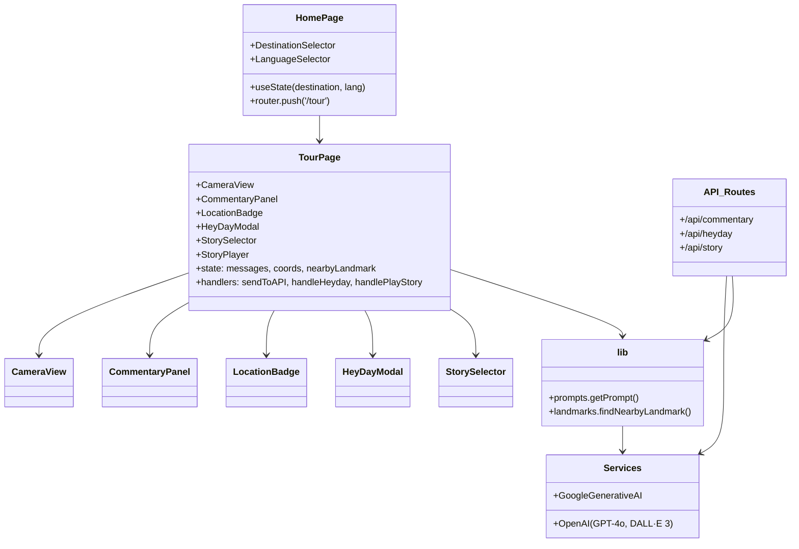

# Virtual Travel Guide

A **Next.js 14** / **TypeScript** web app that turns your phone into an AI-powered virtual tour guide. Point your camera at a landmark, and the app uses generative AI to deliver live commentary, historical reconstructions, and dramatized stories.

---

## 🧭 User Journey & Architecture

### High-level flow

```mermaid
flowchart LR
    subgraph "Home Screen"
        A[User visits "/"] --> B[Select destination]
        B --> C[Select language]
        C --> D[Start Tour]
    end

    subgraph "Tour Experience"
        D --> E[CameraView component initializes]
        E --> F[LocationBadge watches GPS]
        E -->|tap or voice| G[CommentaryPanel opens]
        G -->|user message or camera image| H[POST /api/commentary]
        H --> I[Google Gemini AI]
        I --> G[streamed text response]
        G -->|TTS (optional)| J[Server TTS (/api/tts)]

        E -->|capture image| K[HeyDay modal trigger]
        K -->|POST /api/heyday| L[OpenAI GPT-4o + DALL·E 3]
        L --> K[historical image]

        F -->|coordinates| M[lib/landmarks.findNearbyLandmark]
        M --> N[StorySelector shown]
        N -->|chapter chosen| O[POST /api/story]
        O --> P[OpenAI GPT-4o + DALL·E 3]
        P --> Q[StoryPlayer displays narration & images]
    end
```

### Component relationships



> The diagrams above help you grasp the flow from user interaction through UI components to backend AI services.

---

## 🛠 Running the Project

1. **Install dependencies**
   ```bash
   npm install
   ```

2. **Set environment variables**
   - `GEMINI_API_KEY` for Google Gemini generative AI
   - `OPENAI_API_KEY` for OpenAI GPT-4o / DALL·E
   - *(optional)* `GOOGLE_API_KEY` with a Google Cloud API key enabled for the
     Text‑to‑Speech service (Neural2 voices).  Alternatively you can set
     `GOOGLE_APPLICATION_CREDENTIALS` to a service account JSON and install
     `@google-cloud/text-to-speech`, but the simple API key approach is
     sufficient for this demo.

    The app routes all AI narration through a server TTS endpoint at `/api/tts`.
    Make sure `GOOGLE_API_KEY` or `GOOGLE_APPLICATION_CREDENTIALS` is available
    to the dev server so the route can synthesize Neural2 audio.

3. **Start development server**
   ```bash
   npm run dev
   ```

4. **Visit** `http://localhost:3000` in a browser that supports camera & geolocation (mobile preferred).

---

## 🧩 Key Files & Folders

- `app/` – Next.js 14 server/client components and API routes.
- `components/` – Reusable React components (camera, panels, selectors, modals).
- `lib/` – Utility functions for prompts and landmark/geofencing logic.
- `public/backgrounds` – Default background images for home screen.
- `types/` – TypeScript declarations (e.g. speech recognition).

---

## 🔍 Development Notes

- **Camera access** is handled by the `CameraView` component, which gracefully degrades if the user denies permission.
- **Streaming responses** from Gemini are piped through a `ReadableStream` to render text incrementally.
- **Geolocation** is watched continuously; when near a known landmark, a story selector becomes available.
- **Manual coordinates** are supported for testing: click the location badge to enter latitude/longitude, or add `&lat=...&lng=...` to the tour URL (e.g. `/tour?destination=italy&lang=en&lat=41.8902&lng=12.4922`).
  When coordinates are supplied via the URL the app will automatically ask "What am I looking at?" so you can immediately hear narration for that spot; follow‑up questions or heyday image requests will work just as if you were physically there.
- **Story generation** caches results in `sessionStorage` to avoid repeated API calls.
- **Tailwind CSS** is used with a custom dark / glass aesthetic.

---

## 📝 Suggestions for AI Agents

- **Add example prompts**: e.g., "Help me add a new destination for Egypt" or "Refactor the story caching logic."
- **Create custom agents** for feature areas such as `create-story-chapter`, `add-landmark` or `optimize-camera-performance`.

Feel free to explore and build on this interactive virtual tour guide!
